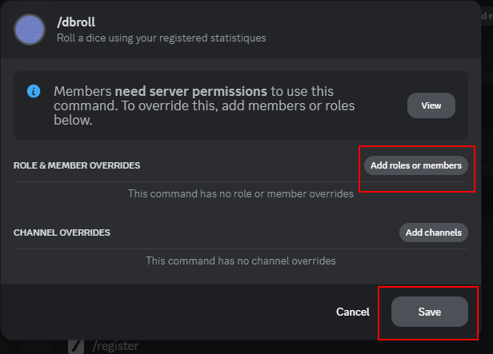

# Dicelette

-> [Invitez le bot](https://discord.com/api/oauth2/authorize?client_id=1182819335878754385&permissions=395137215504&scope=bot+applications.commands)

Permet de lancer des dés et d'envoyer le résultat dans un fil de discussion, mais aussi d'enregistrer un modèle de statistique pour les lancer directement (afin de ne pas être obligé d'écrire la même chose encore et encore).

-> Utilise l'API [@diceRoller](https://dice-roller.github.io/documentation/) pour lancer les dés.

Il prend également en charge la notation rollem `4#(dés)` pour les lancers "en masse" (bulk roll).


Pour les statistiques, au lieu de sauvegarder la feuille entière, il utilisera le message et l'identifiant du message. Ainsi, vous avez le contrôle total sur vos données (puisque le bot ne connaît pas le contenu du message).

Le bot utilise une base de données pour stocker l'identifiant du message et l'identifiant du canal, mais aussi le nom de la statistique et les noms des personnages des utilisateurs. 

La base de données est un simple fichier JSON, et sera nettoyée si :
- Le message statistique de référence est supprimé
- Le canal enregistré pour le modèle est supprimé - Cela ne supprimera **pas** les identifiants de référence de l'utilisateur.
- Le message enregistré pour le modèle est supprimé
- Le thread contenant les données utilisateurs est supprimé
- Le bot est expulsé du serveur

-> Voir [#dbroll](#) pour plus d'informations

La base de données n'est utilisée **que** si vous configurez `/dbroll` et `/logs`.

> [!NOTE]
> Au besoin, vous pouvez me contacter si vous voulez que vos données soient supprimées. Il me suffira de votre identifiant Discord (le long numéro) pour supprimer vos données ou celle de votre serveur (il me faudra alors l'ID du serveur).
> Pour me contacter en privée :
> - Discord: `@mara__li`
> - Mail: `lisandra_dev@yahoo.com`

---

# Comportement
## Logs dans des threads

Le bot fonctionne avec des threads. Lors du premier lancer, il recherchera un fil préfixé par `🎲`.
- Si le fil n'existe pas, un nouveau sera créé et tous les futurs logs y seront envoyés.
- S'il existe déjà un fil, il prendra le plus récent et enverra les logs dedans.

> [!NOTE]
> Si plusieurs fils sont trouvés, le bot utilisera le plus récent et archivera les autres.

Les commandes peuvent également fonctionner dans un fil. Dans ce cas, le bot y enverra simplement le résultat. Ce resultat peut être retrouvé dans les channels dont le nom commence par `🎲`.

Il est également possible de créer un nouveau fil avec la commande [Créer une nouvelle scène](#créer-une-nouvelle-scène).

> [!NOTE]
> Le bot fonctionne aussi dans les forums. La différence étant que :
> - Plusieurs logs peuvent exister en même temps (sauf s'ils ont exactement le même nom)
> - Les logs seront appelés par défaut `🎲 [nom du sujet]` et le tag `🪡 Dice Roll` sera automatiquement appliqué (et créé s'il n'existe pas).
> - C'est donc un poste qui sera créé à la place d'un fil

## Canaux

Le bot enverra **également** le résultat dans le canal où la commande a été envoyée. Le message :
- Sera supprimé après 3 minutes
- Contiendra un lien vers le message dans le log.

# Utilisation

Le bot peut être :
- Utilisé avec des slash-commands (voir [Slashcommands](#slashcommands))
- Mais aussi directement sur le message.

## Envoi de message

Le message détectera la notation des dés et enverra le résultat.

La notation des dés peut être faite de deux manières :
- Directe, comme `1d20` : Dans ce cas, le message "commandes" sera supprimé et le résultat sera envoyé dans le même canal (et dans le log).
- Indirecte, entre crochets, comme : `mon contenu de message [1d20]`. Dans ce cas, le message sera conservé, et le contenu des crochets sera lancé. Vous recevrez une réponse avec le résultat et le log sera envoyé dans le fil. Les logs contiendront un lien vers le message d'origine.
- Semi-directe, comme `1d20 Mon message` : Aura le même comportement que la méthode direct. Le dés trouvé au départ sera lancé, et le reste du message sera envoyé dans le log et considéré comme un commentaire.

## Slashcommands
### Lancer les dés

`/roll 1d20` pour lancer.
Il est possible d'utiliser la notation "semi-direct" en ajoutant un commentaire : `/roll 1d20 Mon commentaire`. La notation "indirecte" n'est pas disponible dans ce mode.

### Créer une nouvelle scène

`/scene <nom>`

Le bot créera un nouveau fil de discussion, préfixé par `🎲`, et enverra le journal dedans. Le fil prendra le nom de la `scène`, et tous les autres fils préfixés par `🎲` seront archivés.

### Aide

`/help` : Affiche le message d'aide.

# Database roll (`/dbroll`)

> [!warning] 
> Par défaut, le `/dbroll` est désactivé ! Vous devez l'activer via la configuration du serveur.
> 
> 
> 
> 
> 

## Générer une nouvelle template (`/generer`)

Pour ma propre santé mentale, j'ai choisi d'utiliser directement un fichier `JSON` pour stocker les données. Utiliser des modaux discord ont quelque limitation, et je ne veux pas les utiliser pour l'enregistrement des modèles directement. Par exemple, les modaux sont limités à 5 champs, donc enregistrer 2 statistiques demanderaient à minima deux modaux (Minimum, maximum, combinaison...)

La commande `/generer` permet de générer un fichier `JSON` personnalisé à partir des différentes options. Vous pouvez donc directement demander un fichier contenant :
- Les différents noms de statistiques (séparée par une virgule ou un espace)
- Le type de dé (qui devra suivre les mêmes règles que pour `/roll`)
- La façon dont le dé sera comparé avec le résultat (vous pouvez laisser vide pour comparer avec la valeur de la statistique directement)
- Un nombre (optionnel) pour le total de point de statistique
- Si l'utilisation d'un nom de personnage est obligatoire pour enregistrer un joueur.
- Une valeur de succès critique (dé naturel)
- Une valeur d'échec critique (dé naturel)
- Une formule pour modifier la valeur lorsque la statistique est ajouté au résultat du dé. Vous devez utiliser `$` pour symboliser la statistique. Par exemple, `+$` pour ajouter la statistique au résultat du dé. La formule accepte des opérations mathématiques comme `floor(($-10)/2)`. L'évaluation se fait avec la librairie [`mathjs`](https://mathjs.org/).

La fichier généré doit être télécharger et éditer. Vous pouvez l'éditer en utilisation n'importe quel éditeur de texte (et même en ligne) pour modifier et ajouter toutes les valeurs.

Voici les références des différents champs :
- `charName` : Un booléen indiquant s'il faut obliger l'utilisateur à choisir un nom pour ses personnages. La valeur par défaut est `false`.
- `statistic` : Objet contenant les statistiques des personnages.
  - Chaque statistique est définie par une série de caractère et un objet contenant les informations suivantes :
    - `max` : Valeur maximale de la statistique.
    - `min` : Valeur minimale de la statistique.
    - `combination` : Permet de calculer la statistique sur la base d'une formule impliquant d'autres statistiques. La statistique calculée sera exclue du total.
- `total` : Valeur totale facultative qui peut être définie pour calculer la valeur totale d'un futur membre enregistré. Si la somme des valeurs dépasse le total, une erreur sera générée et l'utilisateur en sera informé.
- `diceType` : Champ obligatoire spécifiant le type de dé à utiliser pour la statistique.
- `comparator` : Objet définissant comment comparer le résultat du dé avec la statistique.
  - `sign` : Signe à utiliser pour la comparaison (`"<"`, `">"`, `">="`, `"<="`, `"="`, `"!="`).
  - `valeur` : Valeur à comparer avec le résultat. Laisser vide pour comparer avec la valeur de la statistique.
  - `criticalSuccess` : Valeur de succès critique pour les jets de dés ( dé naturel).
  - `criticalFailure` : Valeur critique d'échec pour les jets de dés (dés naturels).
  - `formula` : Formule pour modifier la valeur ajoutée au résultat du dé. Utilisez `$` pour symboliser la statistique. Exemple : `+$` ajoutera la valeur de la statistique au résultat du dé. Supporte les opérations mathématiques comme `floor(($-10)/2)`.

Exemple de modèle JSON:
```json
{
  "charName": true,
  "statistic": {
	"strength": {
	  "max": 20,
	  "min": 3
	},
	"dexterity": {
	  "max": 20,
	  "min": 3
	},
	"constitution": {
	  "max": 20,
	  "min": 3
	},
	"intelligence": {
	  "max": 20,
	  "min": 3
	},
	"wisdom": {
	  "max": 20,
	  "min": 3
	},
	"charisma": {
	  "max": 20,
	  "min": 3
	}
  },
  "total": 100,
  "diceType": "1d20",
  "comparator": {
	"sign": "<=",
	"value": "20",
	"criticalSuccess": 20,
	"criticalFailure": 1,
	"formula": "ceil(($-10)/2)"
  }
}
```

> [!important]
> Vous pouvez jeter un œil au dossier [template][./template] pour voir différents modèles.

## Enregistrer un modèle (`/enregistrer`)

-> `/enregistrer <nom> <fichier>`

Le bot vérifiera le fichier et l'enregistrera. Un embed de référence + le fichier analysé / corrigé sera envoyé dans le canal choisi. Ce canal sera sauvegardé en tant qu'identifiant dans la base de données, ainsi que le `message_id`.

> [!important]
> Ce canal sera utilisé pour enregistrer les utilisateurs.Une discussion sera créée pour enregistrer les utilisateurs. Si une discussion existe déjà (nommée `📝 • [STATS]`), elle sera utilisée.
> Un seul thread sera utilisé à la fois.

L'embed du modèle sera épinglé pour faciliter l'accès.

Si un autre modèle est enregistré (sans que le précédent soit déjà supprimé), l'ancien message sera supprimé automatiquement.

## Enregistrer un utilisateur 

Pour commencer l'enregistrement d'un joueur, vous devez cliquer sur le bouton sous l'embed, créé durant l'étape précédente. 
Un modal s'ouvrira, vous demandant de choisir un nom pour le personnage. Vous pouvez également choisir un nom déjà existant pour modifier les valeurs.
De plus, vous devrez obligatoirement choisir à qui sera assignée la fiche (par défaut, ce champ sera rempli par le nom de l'utilisateur qui aura lancé la création).

Après, vous devrez cliquer sur le bouton `<continuer>` et le bot continuera jusqu'à que toutes les statistiques seront enregistrées (car l'enregistrement se fait de 5 en 5, exceptant les combinaisons de statistiques).

> [!note]
> En raison de la limitation des modaux, il est impossible de vérifier les erreurs au moment de l'envoi et d'utiliser des champs "de nombre". Tous est considéré comme du texte, et les vérifications sont faites durant la sauvegarde, ce qui implique que si une erreur est détectée lors d'une étape, vous devez refaire l'étape en entier. 

## Limitations

- Seulement 20 statistiques sont supportés au maximum, à cause des limitations de l'autocomplète.
- Il est impossible de modifier une statistique déjà enregistrée. Vous devez recréer le personnage (le message précédent sera supprimé en cas de ré-enregistrement)

## DBRoll (`/dbroll`)

Le dbRoll aura les mêmes effets que la commande `/roll`, mais il vous demandera :
- La statistique (obligatoire, utilisera l'autocomplétion)
- le nom du personnage (avec une autocomplétion)
- Le modificateur à ajouter au jet (comme l'avantage, le désavantage, etc.)
- Le remplacement de la valeur de réussite (par exemple, pour un jet difficile)
- N'importe quel personnage (qui doit être enregistré dans la base de données) -- Note : Si vous n'avez qu'un seul personnage enregistré et que l'utilisateur ne met aucune valeur, le premier personnage enregistré sera utilisé.
- Tout commentaire sur votre action

---
# Traduction

Le bot est entièrement traduit en français et en anglais.
Les slash-commands seront automatiquement traduites dans la langue du client utilisé.

> [!TIP]
> Par exemple, un utilisateur dont le client est en français aura les réponses en français, et un utilisateur dont le client est en anglais aura les réponses en anglais.

Mais, pour les message "direct" (c'est-à-dire les messages qui ne sont pas des slash-commands), le bot ne peut pas savoir quelle langue utiliser. Il utilisera donc la langue du serveur, qui ne peut être choisie que pour les Serveurs Communautaires.

### Ajouter une langue

Pour ajouter une lnague, vous devez copier et traduire le fichier [`en.ts`](./src/localizations/locales/en.ts).

> [!IMPORTANT]
> Le nom doit suivre le format des [locales discord.js](https://github.com/discordjs/discord-api-types/blob/main/rest/common.ts#L300).
> Par exemple, `ChineseCN` pour le Chinois (China) et `ChineseTW` pour le Chinois (Taiwan).

Après cela, vous devez ajouter la langue dans le fichier [`index.ts`](./src/localizations/index.ts), tel que :
```ts
import NouvelleTraduction from "./locales/nouvelleTraduction.ts";

export const TRANSLATIONS = {
	// ...
	NouvelleTraduction,
	// ...
}
```