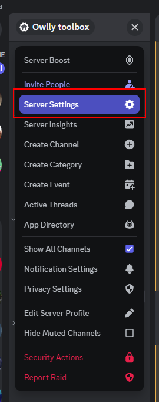
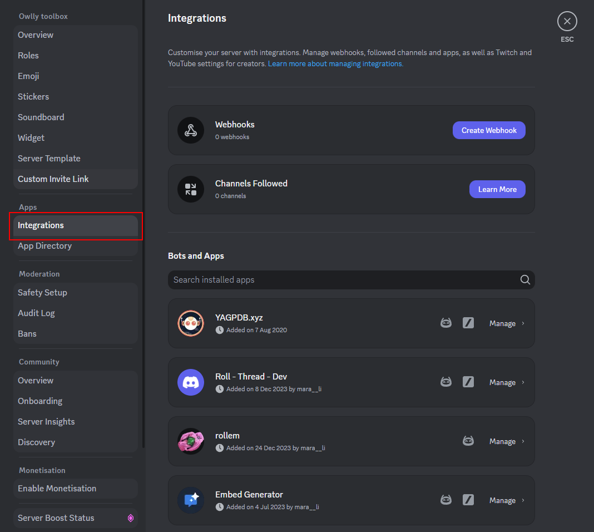
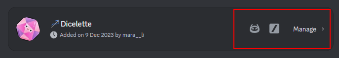
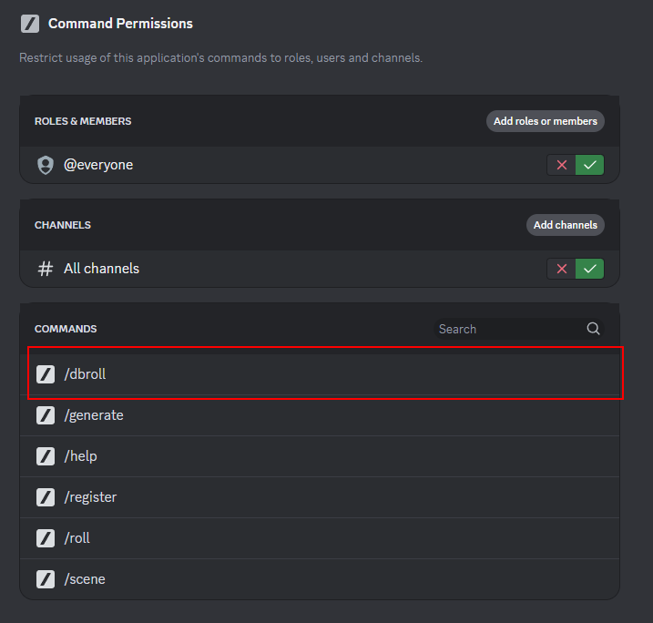

# Dicelette

-> [FRENCH TRANSLATION](README.fr.md) <-

Allows you to throw dice and send the result in a thread, but also register a template of statistic to roll them directly (so you're not obliged to write the same thing again and again).

For statistic, instead of saving the entire sheet, it will use message and message_id. So, you have the entire control on how to delete the message, and the bot will not have access to the content of the message (better for privacy!).

The bot use a database to store message_id and channel_id, but also the statistic name and user character name. 
The database is a simple JSON file, and will be clean if:
- The reference statistic message is deleted
- The registered channel for template is deleted - This will **not** remove user's references ids.
- The registered message for template is deleted
- The bot is kicked from the server

See [#dbroll](#database-roll-dbroll) for more information.

Uses the [@diceRoller](https://dice-roller.github.io/documentation/) API to throw dice.

It also supports the rollem notation `4#(dice)` for bulk rolls.

[Invite the bot](XXXXX)

# Behavior
## Logs Threads
The bot operates with threads. In the first roll, it will search for threads prefixed by `🎲`.
- If the thread doesn't exist, a new one will be created, and all future logs will be sent to it.
- If a thread exists, it will take the most recent and send the log to it.

> [!NOTE]
> If multiple thread logs are found, the bot will use the most recent and archive the others.

The commands can also work in threads. In this case, the bot will just send the result in it. This result can be found in channels whose name begins with `🎲`.

It is also possible to create a new thread with the command [Create a new scene](#create-a-new-scene).

> [!NOTE]
> The bot also works in the forums. The difference being :
> - Several logs can exist at the same time (unless they have exactly the same name).
> - Logs will be called by default `🎲 [topic name]` and the tag `🪡 Dice Roll` will be automatically applied (and created if it doesn't exist).
> - A post will be created instead of a thread.

## Channels

The bot will **also** send the result in the channel where the command was sent. The message:
- Will be deleted after 3 minutes.
- Contains a link to the logs message.

# Usage

The bot can be:
- Used with slash commands (see [Slash Commands](#slash-commands))
- But also directly in messages.

## Message Send

The message will detect the dice notation and send the result.

The dice notation can be in two ways:
- Direct, like `1d20`: In this case, the message "commands" will be deleted, and the result will be sent in the same channel (and in the logs).
- Indirect, in brackets, like: `my message content [1d20]`. In this case, the message will be preserved, and the content of the brackets will be rolled. You will get a reply with the result, and the log will be sent in the thread. The logs will contain a link to the original message.
- Semi-direct, as `1d20 My message` : Will have the same behavior as the direct method. The dice found at the beginning will be rolled, and the rest of the message will be sent to the log and considered as a comment.

## Slash Commands
### Throw Dice

`/roll 1d20` for a roll.
It is possible to use the "semi-direct" notation by adding a comment: `/roll 1d20 My comment`. The "indirect" notation is not available in this mode.

### Create a New Scene

`/scene <name>`

The bot will create a new thread, prefixed by `🎲`, and send the log to it. The thread will take the `scene` name, and all other threads prefixed by `🎲` will be archived.

### Help

`/help`: Display the help message.

# Database roll (dbroll)

> [!warning] 
> By default, the `/dbroll` is disabled! You need to enable it via the Discord server panel configuration.





## Generate new template (`/generate`)

For my own sanity, I choose to use directly JSON file to create statistic. Using modals has some limitations, and I don't want to use it for that (for example, modals are limited to 5 fields per modals, registering only 2 statistic will create 2 modals, and so on).

The `/generate` commands allow to get a personnalized template. You can direcly add:
- The name of the differents statistic, separated by a space of a comma.
- The dice type (using the same notation as the roll command).
- The way dice are compared with statistic,
- The value to compare with the result. Let empty to compare with the statistic value.
- An optional number of statistic points
- If the user **must** set a name for registering a character.
- An critical success value (natural dice)
- An critical failure value (natural dice)
- A formula to edit the value added to the dice result. Use `$` to symbolise the statistic. Example: `+$` will add the value of the statistic to the dice result. It supports mathematical operation like `floor(($-10)/2)`. The evaluation is done with the [`mathjs`](https://mathjs.org/) library.

The generated file must be downloaded and edited using any editor (even online!) to add any value/edit you want.

Here the reference for the different fields:
- `charName`: A boolean flag indicating whether to enforce the user to choose a name for their characters. Default is `false`.
- `statistic`: Object containing statistics for the characters.
  - Each statistic is defined by a string key and an object value with the following optional properties:
    - `max`: Maximum value for the statistic.
    - `min`: Minimum value for the statistic.
    - `combination`: Allows calculation of the statistic based on a formula involving other statistics. The calculated statistic will be excluded from the total.
- `total`: Optional total value that can be set to calculate the total value of a future registered member. If the sum of the values exceeds the total, an error will be thrown, and the user will be informed.
- `diceType`: Mandatory field specifying the type of dice to use for the statistic.
- `comparator`: Object defining how to compare the dice result with the statistic.
  - `sign`: Sign to use for comparison ("<", ">", ">=", "<=", "=", "!=").
  - `value`: Value to compare with the result. Leave empty to compare with the statistic value.
  - `criticalSuccess`: Critical success value for natural dice rolls.
  - `criticalFailure`: Critical failure value for natural dice rolls.
  - `formula`: Formula to modify the value added to the dice result. Use `$` to symbolize the statistic. Example: `+$` will add the value of the statistic to the dice result. Supports mathematical operations like `floor(($-10)/2)`.

Template JSON example:
```json
{
  "charName": true,
  "statistic": {
	"strength": {
	  "max": 20,
	  "min": 3
	},
	"dexterity": {
	  "max": 20,
	  "min": 3
	},
	"constitution": {
	  "max": 20,
	  "min": 3
	},
	"intelligence": {
	  "max": 20,
	  "min": 3
	},
	"wisdom": {
	  "max": 20,
	  "min": 3
	},
	"charisma": {
	  "max": 20,
	  "min": 3
	}
  },
  "total": 100,
  "diceType": "1d20",
  "comparator": {
	"sign": "<=",
	"value": "20",
	"criticalSuccess": 20,
	"criticalFailure": 1,
	"formula": "ceil(($-10)/2)"
  }
}
```
> [!important]
> You can take a look into [template][./template] for some common tested example.

## Registering the template (`/register`)

-> `/register <channel> <path to the file>`

The bot will verify the file and register it. An reference embed + the parsed / corrected file will be send into the choosen channel. This channel will be saved as an id in the database, as well the message_id.

> [!important]
> This channel will be used for saving user. A thread will be created for registering users. If a thread already exists (named as `📝 • [STATS]`), it will use it.
> Only one thread will be used at time.

## Registering a character

The registering of the user use the button under the embed created at the `/register` steps. First modals ask for an character name and the user rattached to the registering. Here, you can use an id or the global name of the user.

After, each 5 statistic (excepted for combinaison stat), it will ask for the value. 

> [!note]
> Because of the limitation of modals:
> - If an error is detected at a steps, you need to re-entered the corrected value, and you can save the "previous" modals. 
> - The value can be verified / forced during registration (only text entry are allowed)
> - Only 5 value are autorized at time:	If you have more than 5 statistic, you need to re-entered the modals by clicking on the "continue" button.

## dbroll commands

The dbRoll will have the same result of the normal roll, but it will ask you:
- The name of the character
- Modificator to add to the roll (like advantage, disadvantage, etc.)
- Remplacement of the success value (for example, for difficult roll)
- Any character (that must be registered in the database) -- Note: If you have only character registered and the user set no value, the first registered character will be used
- Any comments to your action

---
## Translation

The bot is fully translated into French and English.

Slash-commands will be automatically translated into the language of the client used.

> [!TIP]
> For example, an user with a client in Korean will get a reply in Korean, while an English user will get a English reply.

But, if you use the `on message` type of roll detection, the reply will be in the guild's language, which will only can be set for community guild. By default, the reply will be in English.

### Add a translation

To create your own translation, you need to copy and translate the [`en.ts`](./src/localizations/locales/en.ts) file.

> [!IMPORTANT]
> The name must follow the [Discord.js Locale](https://github.com/discordjs/discord-api-types/blob/main/rest/common.ts#L300)
> For example, `ChineseCN` for Chinese (China) or `ChineseTW` for Chinese (Taiwan).

You need, after that, to update the [`index.ts`](./src/localizations/index.ts) file to add your translation :
```ts
import newTranslation from "./locales/{translation}";

export const TRANSLATIONS = {
	//keep the other translations
	newTranslation,
}
```


